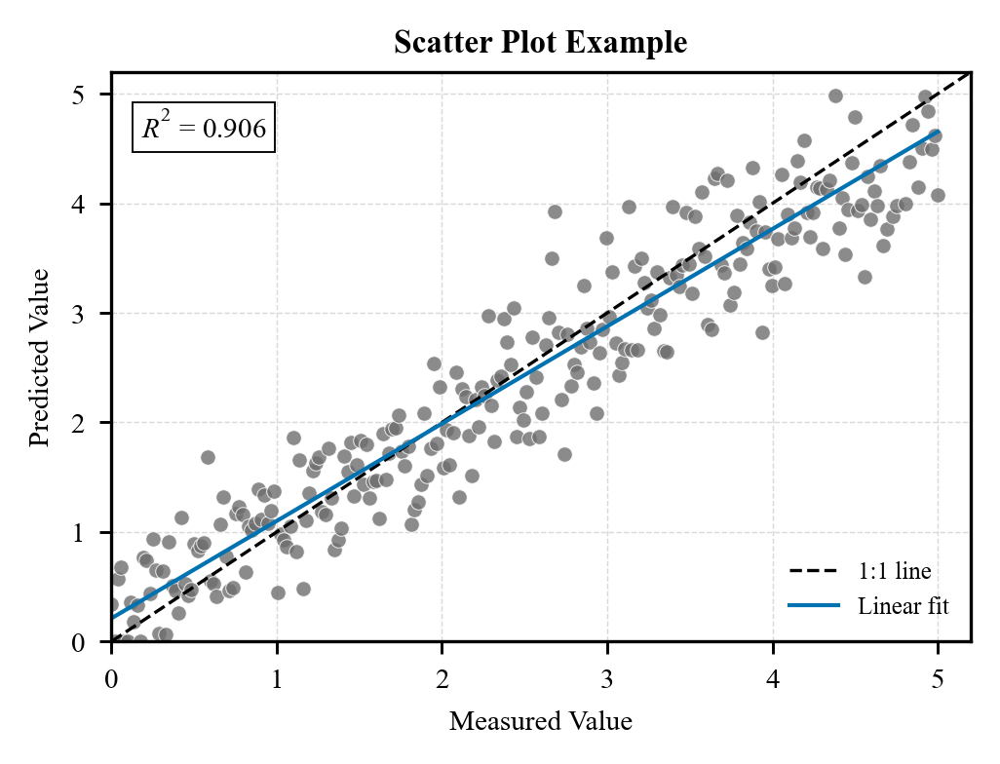
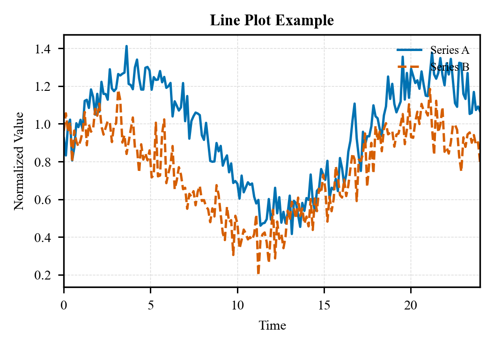
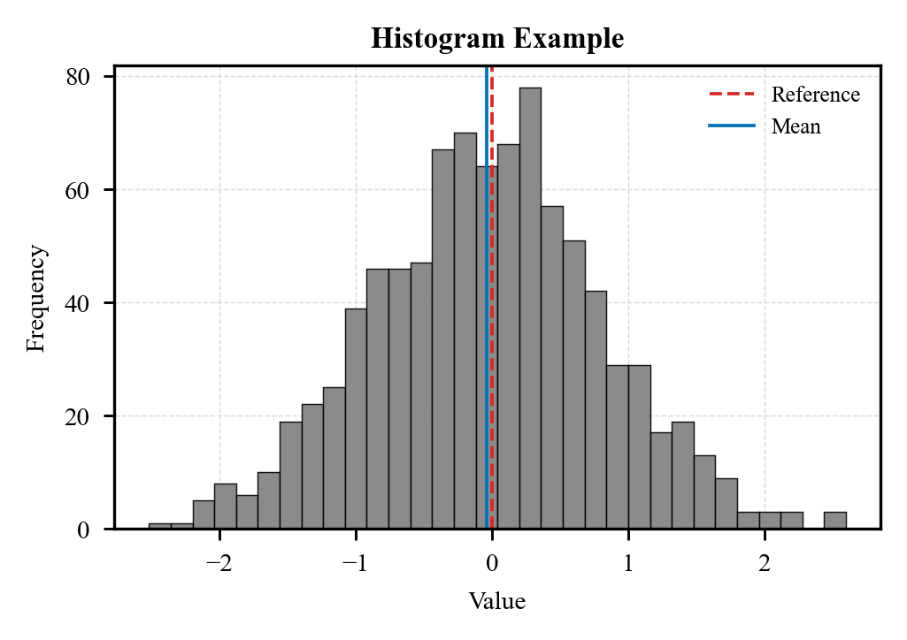

# sci-figure

General-purpose scientific figure instructions for AI agents.

`sci-figure` helps an AI agent create publication-ready scientific plots with a
clear figure contract, backend discipline, editable exports, and restrained SCI
visual styling. It is platform independent: copy `skill.md` into any agent
prompt, project memory, or instruction bundle.

The skill is designed for manuscript figures, technical reports, multi-panel
scientific plots, and reproducible chart scripts. It supports Python workflows
with `matplotlib`/`seaborn` and R workflows with `ggplot2`/`patchwork`.

## Example gallery

These previews use simulated data and the default style rules: Times-style
typography, full-box axes, outward ticks on the left and bottom only, editable
export settings, and neutral scientific palettes.

| Figure | Preview | Demonstrates |
|---|---|---|
| Scatter plot |  | Correlation, 1:1 reference, linear fit, compact statistics annotation |
| Line plot |  | Multi-series trend comparison, restrained legend, light guide grid |
| Histogram |  | Distribution summary, reference line, mean marker, compact axis labels |

Gallery PNGs are lightweight previews for documentation. For manuscript use,
regenerate editable SVG/PDF and high-resolution TIFF/PNG from the scripts.

## Chart-type atlas

| Chart family | Common use |
|---|---|
| Scatter and bubble plots | Correlation, calibration, clusters, third-variable encoding |
| Line and trend plots | Time courses, longitudinal series, uncertainty ribbons |
| Bar charts | Group comparison, ablation, signed deltas, stacked composition |
| Heatmaps | Matrices, z-scores, annotated grids, sensitivity maps |
| Histograms and densities | Distribution shape, residuals, error spread |
| Box and violin plots | Group spread, sample-level variability |
| Forest and interval plots | Effect sizes, confidence intervals, point ranges |
| Multi-panel layouts | Evidence hierarchy, validation panels, comparative summaries |

## File structure

```text
sci-figure/
├── README.md
├── LICENSE
├── skill.md
├── references/
│   ├── backend-selection.md
│   ├── style-guide.md
│   ├── chart-patterns.md
│   └── qa-checklist.md
└── examples/
    ├── python/
    │   ├── scatter_example.py
    │   ├── line_example.py
    │   └── histogram_example.py
    └── gallery/
        ├── scatter-example.png
        ├── line-example.png
        └── histogram-example.png
```

## Quick start

1. Give `skill.md` to an AI agent.
2. Ask for a scientific figure and specify Python or R.
3. Provide data, target dimensions, and export needs.
4. Run the generated script and inspect the output before manuscript use.

Example prompt:

```text
Use the sci-figure skill to create a Python scatter plot for a manuscript.
The plot should compare measured and predicted values, export SVG/PDF/TIFF,
and follow the default SCI style.
```

Run the included Python examples:

```powershell
python examples/python/scatter_example.py
python examples/python/line_example.py
python examples/python/histogram_example.py
```

Each script writes a PNG preview to `examples/gallery/`.

## Design rules

- Build the figure around a scientific claim, not around decoration.
- Use one backend for all rendering once Python or R is selected.
- Keep text editable in SVG/PDF outputs.
- Prefer Times New Roman for manuscript figures, with compatible math text.
- Keep all four axis spines visible by default.
- Show ticks only on the left and bottom, and point them outward.
- Use panel subtitles only for multi-panel figures.
- Use compact, restrained color systems that survive grayscale review.

## License

MIT License. See `LICENSE`.
