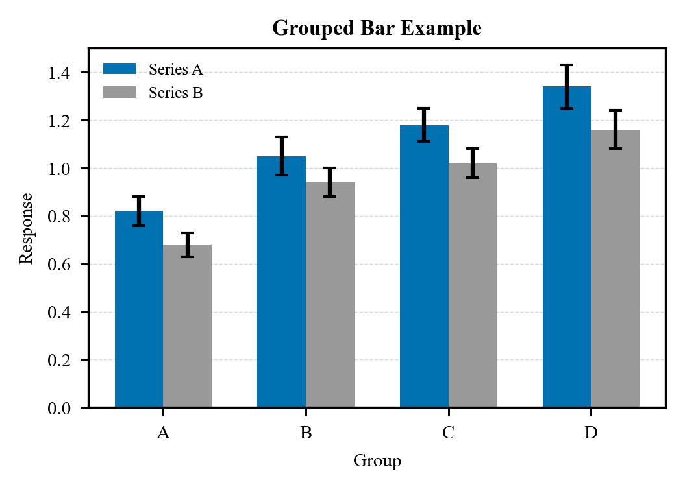
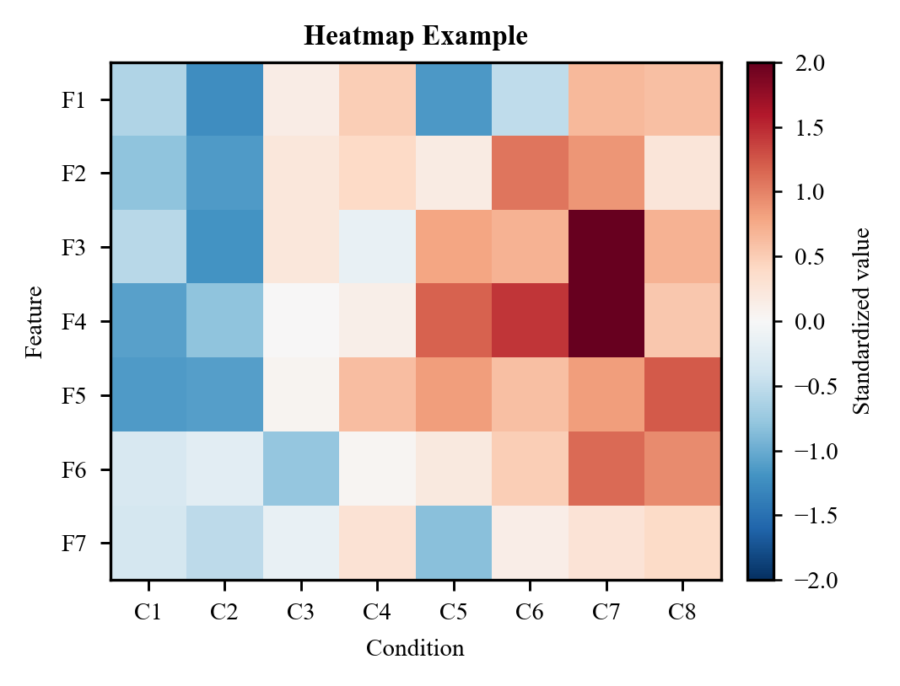
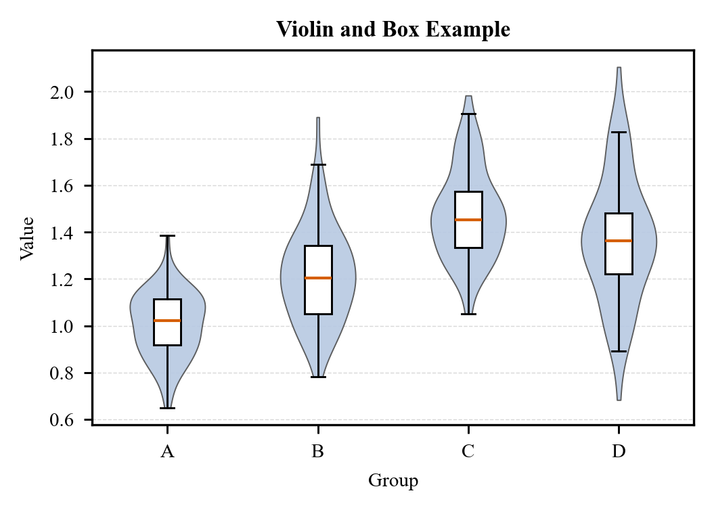
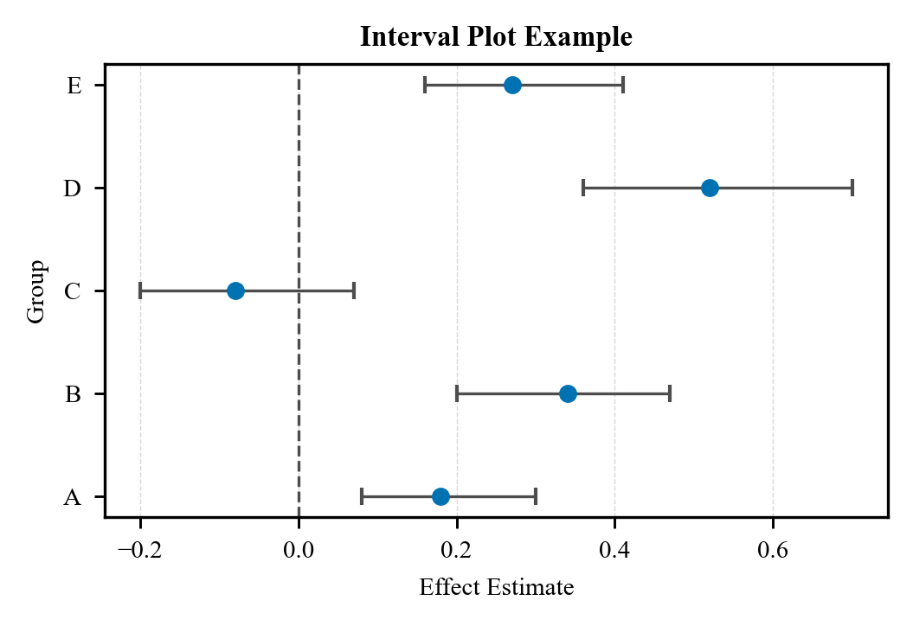
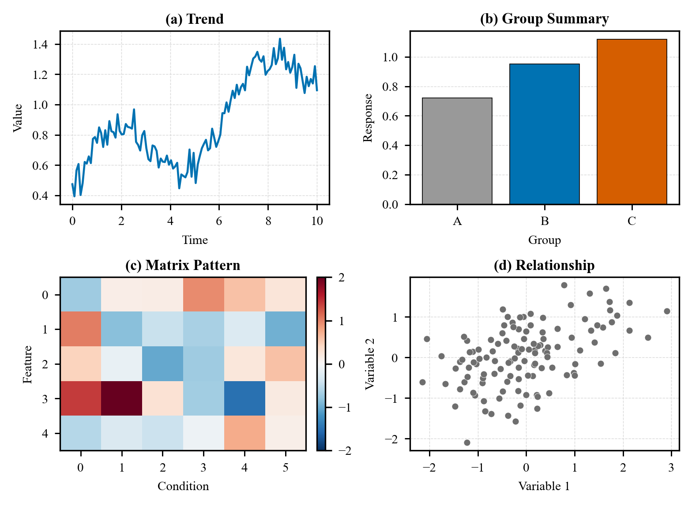

# sci-figure

English | [中文](#中文)

General-purpose scientific figure instructions for AI agents, designed for
publication-ready SCI-style figures with an Elsevier-friendly visual language.

Project page: https://xiao-yuling.github.io/sci-figure/

`sci-figure` was inspired by the organization of the
[`nature-figure`](https://github.com/Yuan1z0825/nature-skills/tree/main/skills/nature-figure)
skill, especially its idea of starting from a figure contract before styling.
This project is not a copy of that skill: it uses its own platform-independent
instructions, examples, and style rules. The defaults here are tuned for
Elsevier-style manuscript figures: Times-style typography, full-box axes,
outward ticks on the left and bottom only, compact panel titles, and restrained
scientific palettes.

`sci-figure` is not tied to any specific AI platform. Copy `skill.md` into any
agent prompt, project memory, or instruction bundle.

## Example gallery

These previews use simulated data and the default style rules: Times-style
typography, full-box axes, outward ticks on the left and bottom only, editable
export settings, and neutral scientific palettes.

| Figure | Preview | Demonstrates |
|---|---|---|
| Scatter plot |  | Correlation, 1:1 reference, linear fit, compact statistics annotation |
| Line plot |  | Multi-series trend comparison, restrained legend, light guide grid |
| Histogram |  | Distribution summary, reference line, mean marker, compact axis labels |
| Grouped bar plot |  | Group comparison, uncertainty caps, restrained categorical color |
| Heatmap |  | Matrix patterns, diverging scale, compact colorbar |
| Violin and box plot |  | Distribution shape, median emphasis, group spread |
| Interval plot |  | Effect estimates, uncertainty intervals, null reference |
| Multi-panel figure |  | Integrated panel titles, mixed evidence, compact layout |

Gallery PNGs are lightweight previews for documentation. For manuscript use,
regenerate editable SVG/PDF and high-resolution TIFF/PNG from the scripts.

## Chart-type atlas

| Chart family | Common use |
|---|---|
| Scatter and bubble plots | Correlation, calibration, clusters, third-variable encoding |
| Line and trend plots | Time courses, longitudinal series, uncertainty ribbons |
| Bar charts | Group comparison, ablation, signed deltas, stacked composition |
| Heatmaps | Matrices, z-scores, annotated grids, sensitivity maps |
| Histograms and densities | Distribution shape, residuals, error spread |
| Box and violin plots | Group spread, sample-level variability |
| Forest and interval plots | Effect sizes, confidence intervals, point ranges |
| Multi-panel layouts | Evidence hierarchy, validation panels, comparative summaries |

## File structure

```text
sci-figure/
├── README.md
├── LICENSE
├── skill.md
├── references/
│   ├── backend-selection.md
│   ├── style-guide.md
│   ├── chart-patterns.md
│   └── qa-checklist.md
└── examples/
    ├── python/
    │   ├── scatter_example.py
    │   ├── line_example.py
    │   ├── histogram_example.py
    │   ├── bar_example.py
    │   ├── heatmap_example.py
    │   ├── violin_box_example.py
    │   ├── errorbar_example.py
    │   └── multipanel_example.py
    └── gallery/
        ├── scatter-example.png
        ├── line-example.png
        ├── histogram-example.png
        ├── bar-example.png
        ├── heatmap-example.png
        ├── violin-box-example.png
        ├── interval-example.png
        └── multipanel-example.png
```

## Quick start

1. Give `skill.md` to an AI agent.
2. Ask for a scientific figure and specify Python or R.
3. Provide data, target dimensions, and export needs.
4. Run the generated script and inspect the output before manuscript use.

Example prompt:

```text
Use the sci-figure skill to create a Python scatter plot for a manuscript.
The plot should compare measured and predicted values, export SVG/PDF/TIFF,
and follow the default SCI style.
```

Run the included Python examples:

```powershell
python examples/python/scatter_example.py
python examples/python/line_example.py
python examples/python/histogram_example.py
python examples/python/bar_example.py
python examples/python/heatmap_example.py
python examples/python/violin_box_example.py
python examples/python/errorbar_example.py
python examples/python/multipanel_example.py
```

Each script writes a PNG preview to `examples/gallery/`.

## Design rules

- Build the figure around a scientific claim, not around decoration.
- Use one backend for all rendering once Python or R is selected.
- Keep text editable in SVG/PDF outputs.
- Prefer Times New Roman for manuscript figures, with compatible math text.
- Keep all four axis spines visible by default.
- Show ticks only on the left and bottom, and point them outward.
- Use panel subtitles only for multi-panel figures.
- Use compact, restrained color systems that survive grayscale review.

## Search keywords

scientific figure, publication figure, SCI figure, Elsevier figure style, AI
agent skill, manuscript plots, matplotlib, ggplot2, editable SVG, research
visualization.

## 中文

`sci-figure` 是一套面向 AI agent 的通用科研绘图指令包，用于生成适合
SCI 论文、技术报告和投稿图的可复现图表。

项目主页：https://xiao-yuling.github.io/sci-figure/

本项目参考了
[`nature-figure`](https://github.com/Yuan1z0825/nature-skills/tree/main/skills/nature-figure)
的组织方式，尤其是“先建立 figure contract，再进入绘图和美化”的思路。
但 `sci-figure` 不是对它的复制：这里的说明、示例和默认样式都是重新编写的，
更偏向 Elsevier / SCI 工程类期刊常见的视觉规范，例如 Times 系列字体、四边框坐标轴、
只在左侧和下方显示外向刻度、紧凑的多子图标题，以及克制的科研配色。

`sci-figure` 不绑定任何特定 AI 平台。你可以把 `skill.md` 交给任意 AI agent，
也可以把其中的规则复制到项目提示词、agent memory 或团队绘图规范中。

## 示例图库

下面的图片都由模拟数据生成，展示默认样式规则：Times 风格字体、四边框、
仅左/下外向刻度、可编辑导出设置，以及中性的科研配色。

| 图类型 | 预览 | 展示内容 |
|---|---|---|
| 散点图 |  | 相关关系、1:1 参考线、线性拟合、紧凑统计标注 |
| 折线图 |  | 多序列趋势比较、克制图例、浅色辅助网格 |
| 直方图 |  | 分布概览、参考线、均值标记、紧凑坐标轴标签 |
| 分组柱状图 |  | 组间比较、误差帽、克制分类配色 |
| 热图 |  | 矩阵模式、发散色标、紧凑 colorbar |
| 小提琴 + 箱线图 |  | 分布形状、中位数强调、组内离散程度 |
| 区间图 |  | 效应估计、不确定性区间、零值参考线 |
| 多子图组合 |  | 集成式子图标题、混合证据、紧凑版式 |

图库中的 PNG 是 README 预览图。正式投稿时，应从脚本重新导出可编辑的 SVG/PDF
和高分辨率 TIFF/PNG。

## 图类型索引

| 图族 | 常见用途 |
|---|---|
| 散点图和气泡图 | 相关性、校准、聚类、第三变量编码 |
| 折线图和趋势图 | 时间序列、纵向变化、不确定性带 |
| 柱状图 | 组间比较、消融实验、有符号差值、堆叠组成 |
| 热图 | 矩阵、z-score、标注网格、敏感性分析 |
| 直方图和密度图 | 分布形状、残差、误差分布 |
| 箱线图和小提琴图 | 组内离散、样本级变化 |
| 森林图和区间图 | 效应量、置信区间、点估计范围 |
| 多子图版式 | 证据层级、验证面板、对比汇总 |

## 文件结构

```text
sci-figure/
├── README.md
├── LICENSE
├── skill.md
├── references/
│   ├── backend-selection.md
│   ├── style-guide.md
│   ├── chart-patterns.md
│   └── qa-checklist.md
└── examples/
    ├── python/
    │   ├── scatter_example.py
    │   ├── line_example.py
    │   ├── histogram_example.py
    │   ├── bar_example.py
    │   ├── heatmap_example.py
    │   ├── violin_box_example.py
    │   ├── errorbar_example.py
    │   └── multipanel_example.py
    └── gallery/
        ├── scatter-example.png
        ├── line-example.png
        ├── histogram-example.png
        ├── bar-example.png
        ├── heatmap-example.png
        ├── violin-box-example.png
        ├── interval-example.png
        └── multipanel-example.png
```

## 快速开始

1. 把 `skill.md` 提供给 AI agent。
2. 请求绘制科研图，并明确选择 Python 或 R。
3. 提供数据、目标尺寸和导出需求。
4. 运行生成的脚本，并在正式投稿前检查输出。

示例提示词：

```text
Use the sci-figure skill to create a Python scatter plot for a manuscript.
The plot should compare measured and predicted values, export SVG/PDF/TIFF,
and follow the default SCI style.
```

运行示例脚本：

```powershell
python examples/python/scatter_example.py
python examples/python/line_example.py
python examples/python/histogram_example.py
python examples/python/bar_example.py
python examples/python/heatmap_example.py
python examples/python/violin_box_example.py
python examples/python/errorbar_example.py
python examples/python/multipanel_example.py
```

每个脚本都会把 PNG 预览图写入 `examples/gallery/`。

## 设计规则

- 先围绕科学结论组织图，而不是先追求装饰效果。
- 一旦选择 Python 或 R，所有渲染、预览、导出和检查都使用同一个后端。
- SVG/PDF 中尽量保留可编辑文字。
- 论文图优先使用 Times New Roman，并保持兼容的数学字体。
- 默认保留四条坐标轴边框。
- 刻度只显示在左侧和下方，并朝外。
- 只有多子图才使用 `(a) Panel title` 形式的子图标题。
- 使用紧凑、克制、灰度下仍可读的配色。

## 搜索关键词

科研绘图、SCI 绘图、论文图、投稿图、Elsevier 风格、爱思唯尔绘图风格、
AI agent skill、matplotlib、ggplot2、可编辑 SVG、科研可视化。

## License / 许可证

MIT License. See `LICENSE`.
